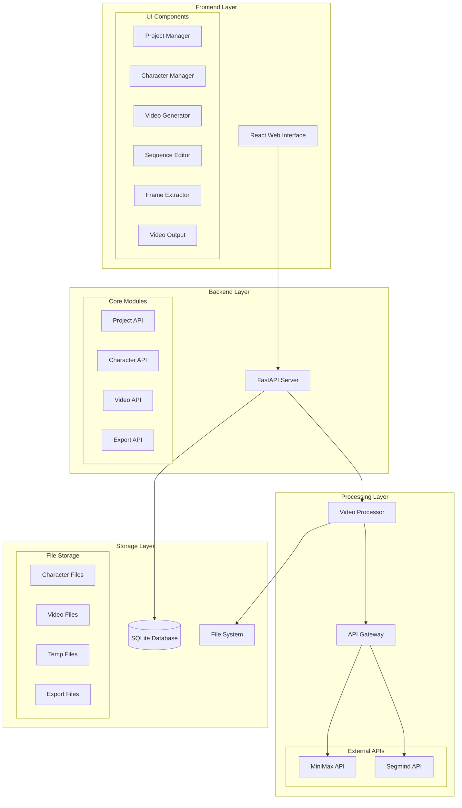
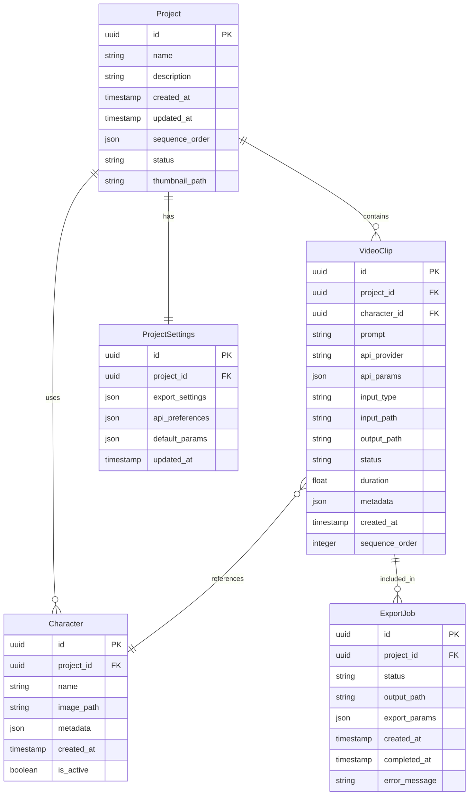
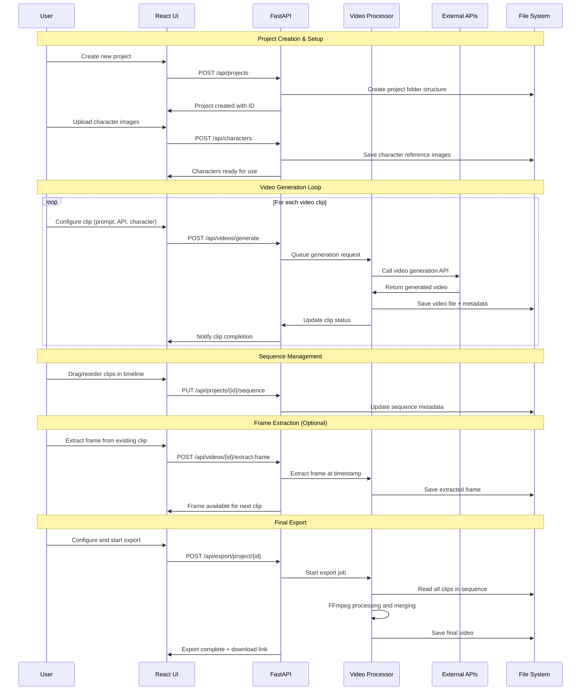
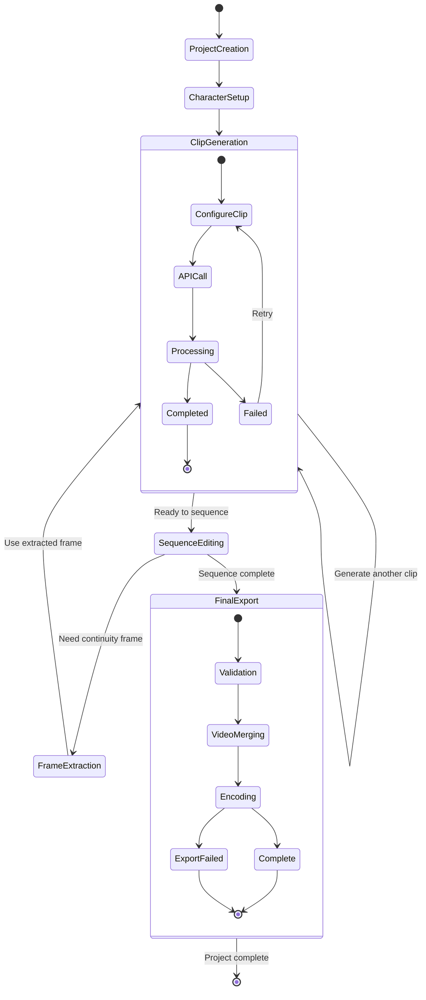
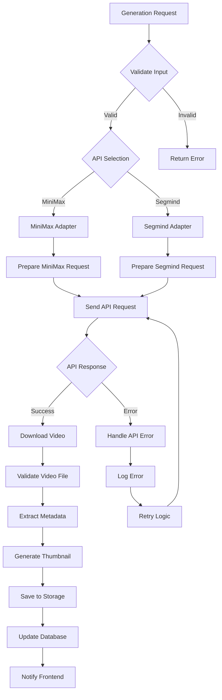
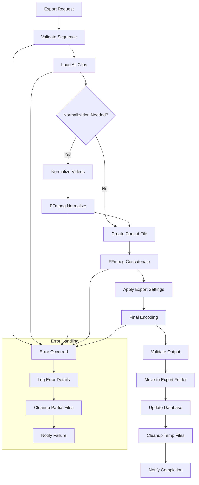
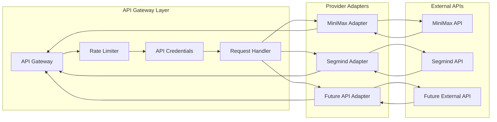
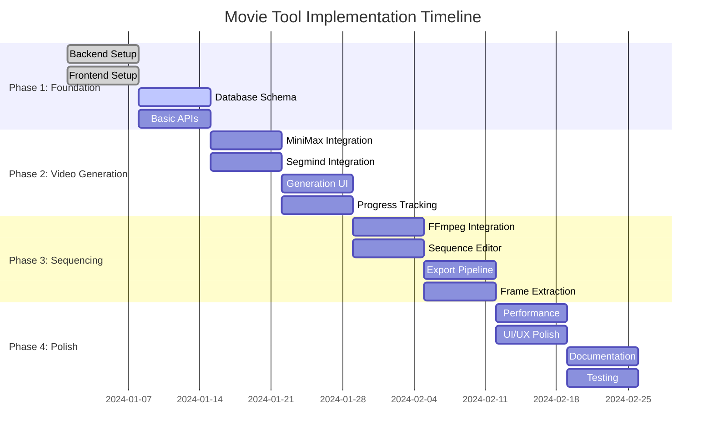
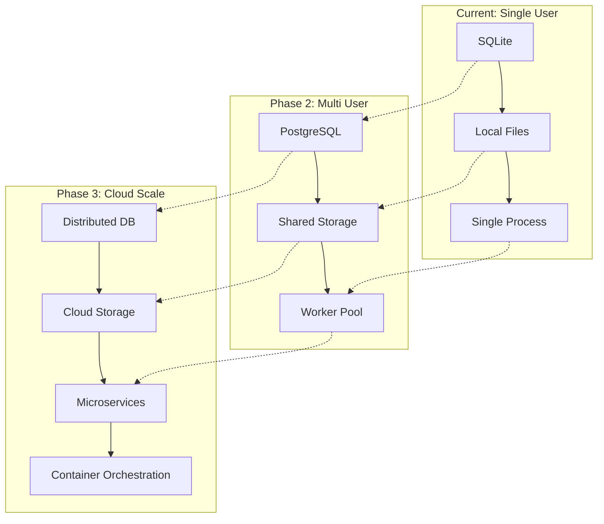

# Movie Tool Application - System Architecture

## Executive Summary

This document outlines the comprehensive architecture for a movie tool application that enables AI-powered video creation, sequencing, and export. The system integrates MiniMax and Segmind APIs for video generation, provides an intuitive drag-and-drop interface for clip management, and includes robust video processing capabilities.

## Table of Contents

1. [System Overview](#system-overview)
2. [Technology Stack](#technology-stack)
3. [Architecture Components](#architecture-components)
4. [Database Design](#database-design)
5. [Core Workflow](#core-workflow)
6. [Component Specifications](#component-specifications)
7. [Processing Pipeline](#processing-pipeline)
8. [Technical Challenges & Solutions](#technical-challenges--solutions)
9. [Implementation Plan](#implementation-plan)
10. [Scalability Considerations](#scalability-considerations)

## System Overview

The Movie Tool is designed as a modular web application with clear separation of concerns:

- **Frontend**: React-based user interface with drag-and-drop capabilities
- **Backend**: Python FastAPI server with async processing
- **Processing**: FFmpeg-based video processing pipeline
- **Storage**: SQLite database with local file system storage
- **External**: Integration with MiniMax and Segmind video generation APIs

### Overall System Architecture



## Technology Stack

### Frontend Technologies

| Component | Technology | Rationale |
|-----------|------------|-----------|
| **Framework** | React 18 with TypeScript | Component-based architecture, excellent ecosystem, type safety |
| **Drag & Drop** | React DnD | Mature library for complex drag/drop interactions |
| **Styling** | Tailwind CSS | Utility-first approach, rapid development, consistent design |
| **State Management** | React Query + Zustand | Server state caching + client state management |
| **Build Tool** | Vite | Fast development, modern bundling |

### Backend Technologies

| Component | Technology | Rationale |
|-----------|------------|-----------|
| **Framework** | FastAPI | Async support, automatic OpenAPI docs, excellent performance |
| **Language** | Python 3.11+ | Rich ecosystem, excellent AI/ML libraries |
| **Database ORM** | SQLAlchemy + Alembic | Mature ORM with migration support |
| **Validation** | Pydantic | Data validation and serialization |
| **HTTP Client** | httpx | Async HTTP client for API calls |

### Processing & Storage

| Component | Technology | Rationale |
|-----------|------------|-----------|
| **Video Processing** | FFmpeg + python-ffmpeg | Industry standard, comprehensive format support |
| **Image Processing** | Pillow | Standard Python imaging library |
| **Database** | SQLite | Simple setup, file-based, sufficient for single-user |
| **File Storage** | Local filesystem | Fast access, easy backup, simple management |

## Architecture Components

### Frontend Component Structure

```
src/
├── components/
│   ├── project/
│   │   ├── ProjectManager.tsx
│   │   ├── ProjectSettings.tsx
│   │   └── ProjectList.tsx
│   ├── character/
│   │   ├── CharacterManager.tsx
│   │   ├── CharacterUpload.tsx
│   │   └── CharacterList.tsx
│   ├── video/
│   │   ├── VideoGenerator.tsx
│   │   ├── VideoPreview.tsx
│   │   └── GenerationQueue.tsx
│   ├── sequence/
│   │   ├── SequenceEditor.tsx
│   │   ├── Timeline.tsx
│   │   └── ClipCard.tsx
│   ├── export/
│   │   ├── ExportManager.tsx
│   │   ├── ExportProgress.tsx
│   │   └── ExportSettings.tsx
│   └── shared/
│       ├── LoadingSpinner.tsx
│       ├── ErrorBoundary.tsx
│       └── FileUpload.tsx
├── hooks/
├── services/
├── types/
└── utils/
```

### Backend Module Structure

```
app/
├── api/
│   ├── routes/
│   │   ├── projects.py
│   │   ├── characters.py
│   │   ├── videos.py
│   │   └── export.py
│   └── dependencies.py
├── core/
│   ├── config.py
│   ├── database.py
│   └── security.py
├── models/
│   ├── project.py
│   ├── character.py
│   ├── video.py
│   └── export.py
├── services/
│   ├── video_processor.py
│   ├── api_gateway.py
│   ├── minimax_client.py
│   ├── segmind_client.py
│   └── ffmpeg_processor.py
├── schemas/
└── utils/
```

## Database Design

### Entity Relationship Diagram



### Database Schema Details

#### Projects Table
- **Purpose**: Core project management
- **Key Fields**: name, description, sequence_order (JSON array of clip IDs)
- **Status Values**: 'active', 'archived', 'deleted'

#### Characters Table
- **Purpose**: Character reference image management
- **Key Fields**: name, image_path, metadata (JSON for API-specific data)
- **Relations**: Belongs to project, referenced by video clips

#### VideoClips Table
- **Purpose**: Individual video clip management
- **Key Fields**: prompt, api_provider, input/output paths, sequence_order
- **Status Values**: 'pending', 'generating', 'completed', 'failed', 'processing'

#### ProjectSettings Table
- **Purpose**: Project-specific configuration
- **Key Fields**: export_settings, api_preferences, default_params (all JSON)

#### ExportJobs Table
- **Purpose**: Track export operations and history
- **Key Fields**: status, output_path, export_params
- **Status Values**: 'queued', 'processing', 'completed', 'failed'

## Core Workflow

### User Journey Flow



### State Management Flow



## Component Specifications

### 1. Project Manager Component

**Purpose**: Central hub for project creation, loading, and management

**Features**:
- Create new projects with templates
- Load existing projects
- Project metadata editing
- Recent projects list
- Project templates (e.g., "Character Introduction", "Scene Transition")

**Props Interface**:
```typescript
interface ProjectManagerProps {
  onProjectSelect: (projectId: string) => void;
  currentProject?: Project;
}

interface Project {
  id: string;
  name: string;
  description: string;
  createdAt: Date;
  updatedAt: Date;
  thumbnailPath?: string;
  clipCount: number;
  status: 'active' | 'archived' | 'deleted';
}
```

**Key Methods**:
- `createProject(name: string, description: string)`
- `loadProject(projectId: string)`
- `duplicateProject(projectId: string)`
- `archiveProject(projectId: string)`

### 2. Character Manager Component

**Purpose**: Upload, organize, and manage character reference images

**Features**:
- Drag-and-drop image upload
- Character naming and categorization
- Image preview with metadata
- Character activation/deactivation
- Batch character import

**Props Interface**:
```typescript
interface CharacterManagerProps {
  projectId: string;
  onCharacterSelect: (characterId: string) => void;
  selectedCharacter?: Character;
}

interface Character {
  id: string;
  projectId: string;
  name: string;
  imagePath: string;
  metadata: {
    imageSize: { width: number; height: number };
    fileSize: number;
    uploadDate: Date;
    apiCompatibility: string[];
  };
  isActive: boolean;
}
```

**Key Methods**:
- `uploadCharacter(file: File, name: string)`
- `updateCharacter(characterId: string, updates: Partial<Character>)`
- `deleteCharacter(characterId: string)`
- `toggleCharacterActive(characterId: string)`

### 3. Video Generator Component

**Purpose**: Configure and generate individual video clips

**Features**:
- API provider selection (MiniMax/Segmind)
- Prompt input with templates and history
- Character reference selection
- Advanced parameter controls (camera movement, style, etc.)
- Generation queue management
- Real-time progress tracking

**Props Interface**:
```typescript
interface VideoGeneratorProps {
  projectId: string;
  characters: Character[];
  onClipGenerated: (clip: VideoClip) => void;
}

interface GenerationRequest {
  prompt: string;
  apiProvider: 'minimax' | 'segmind';
  characterId?: string;
  inputType: 'text' | 'image' | 'video';
  inputPath?: string;
  parameters: {
    duration?: number;
    style?: string;
    cameraMovement?: string;
    aspectRatio?: string;
    seed?: number;
  };
}
```

**Key Methods**:
- `generateClip(request: GenerationRequest)`
- `cancelGeneration(jobId: string)`
- `retryGeneration(clipId: string)`
- `previewPrompt(prompt: string)`

### 4. Sequence Editor Component

**Purpose**: Drag-and-drop timeline for clip organization and sequencing

**Features**:
- Visual timeline with clip thumbnails
- Drag-and-drop reordering
- Clip trimming and gap management
- Transition effects configuration
- Timeline zoom and navigation
- Bulk operations (select, delete, duplicate)

**Props Interface**:
```typescript
interface SequenceEditorProps {
  projectId: string;
  clips: VideoClip[];
  onSequenceUpdate: (sequence: string[]) => void;
}

interface TimelineState {
  clips: VideoClip[];
  selectedClips: string[];
  playheadPosition: number;
  zoomLevel: number;
  totalDuration: number;
}
```

**Key Methods**:
- `reorderClips(dragIndex: number, dropIndex: number)`
- `selectClip(clipId: string, multiSelect: boolean)`
- `deleteSelectedClips()`
- `duplicateClip(clipId: string)`
- `trimClip(clipId: string, startTime: number, endTime: number)`

### 5. Frame Extractor Component

**Purpose**: Extract specific frames from videos for continuity

**Features**:
- Video scrubber timeline
- Frame-by-frame navigation
- Multiple frame selection
- Export frame as character reference
- Batch frame extraction

**Props Interface**:
```typescript
interface FrameExtractorProps {
  videoClip: VideoClip;
  onFrameExtracted: (framePath: string) => void;
}

interface FrameExtractionRequest {
  videoPath: string;
  timestamp: number;
  outputFormat: 'png' | 'jpg';
  quality: number;
  useAsCharacterReference: boolean;
}
```

**Key Methods**:
- `extractFrame(request: FrameExtractionRequest)`
- `extractMultipleFrames(timestamps: number[])`
- `setAsCharacterReference(framePath: string)`

### 6. Video Output Component

**Purpose**: Final video export and rendering management

**Features**:
- Export preset management
- Custom export settings
- Progress tracking with ETA
- Export history and re-export
- Multiple format support

**Props Interface**:
```typescript
interface VideoOutputProps {
  projectId: string;
  clips: VideoClip[];
  onExportComplete: (outputPath: string) => void;
}

interface ExportSettings {
  resolution: '720p' | '1080p' | '4K';
  frameRate: number;
  codec: 'h264' | 'h265' | 'av1';
  quality: 'low' | 'medium' | 'high' | 'lossless';
  audioSettings?: {
    enabled: boolean;
    codec: string;
    bitrate: number;
  };
}
```

**Key Methods**:
- `startExport(settings: ExportSettings)`
- `cancelExport(jobId: string)`
- `getExportHistory(projectId: string)`
- `reExport(jobId: string)`

## Processing Pipeline

### Video Generation Pipeline



### Export Pipeline Architecture



### API Integration Strategy



## Technical Challenges & Solutions

### 1. Short Clip Duration Limitations

**Challenge**: APIs generate 6-10 second clips, but users want longer sequences

**Solutions**:
- **Seamless Transitions**: Use frame extraction to create smooth transitions
- **Smart Sequencing**: Analyze clip endings/beginnings for compatibility
- **Overlap Management**: Detect and handle overlapping content
- **Intelligent Bridging**: Generate short bridge clips between scenes

**Implementation**:
```python
class ClipSequencer:
    def analyze_transition_compatibility(self, clip1: VideoClip, clip2: VideoClip) -> float:
        """Analyze how well two clips transition together (0-1 score)"""
        end_frame = self.extract_frame(clip1, -1)
        start_frame = self.extract_frame(clip2, 0)
        return self.calculate_visual_similarity(end_frame, start_frame)
    
    def suggest_bridge_clip(self, clip1: VideoClip, clip2: VideoClip) -> GenerationRequest:
        """Suggest parameters for a bridge clip between two clips"""
        pass
```

### 2. Video Format Normalization

**Challenge**: Different APIs return different resolutions (1080p vs 720p) and formats

**Solutions**:
- **Standardized Pipeline**: Convert all clips to common format before sequencing
- **Quality Upscaling**: Intelligent upscaling for lower resolution clips
- **Aspect Ratio Handling**: Crop, pad, or stretch based on user preference
- **Frame Rate Synchronization**: Ensure consistent frame rates across clips

**Implementation**:
```python
class VideoNormalizer:
    def __init__(self, target_resolution: str = "1080p", target_fps: int = 30):
        self.target_resolution = target_resolution
        self.target_fps = target_fps
    
    def normalize_clip(self, input_path: str, output_path: str) -> bool:
        """Normalize video to standard format"""
        ffmpeg_cmd = [
            'ffmpeg', '-i', input_path,
            '-vf', f'scale={self._get_resolution_filter()}',
            '-r', str(self.target_fps),
            '-c:v', 'libx264',
            '-preset', 'medium',
            '-crf', '23',
            output_path
        ]
        return self._execute_ffmpeg(ffmpeg_cmd)
```

### 3. Character Consistency Management

**Challenge**: Maintaining character appearance across multiple clips and API providers

**Solutions**:
- **Reference Image Database**: Store high-quality character references
- **API-Specific Handling**: Optimize character usage for each API's requirements
- **Consistency Scoring**: Rate character consistency across generated clips
- **Fallback Strategies**: Multiple approaches if primary method fails

**Implementation**:
```python
class CharacterConsistencyManager:
    def prepare_character_reference(self, character: Character, api_provider: str) -> dict:
        """Prepare character data optimized for specific API"""
        if api_provider == "minimax":
            return self._prepare_minimax_character(character)
        elif api_provider == "segmind":
            return self._prepare_segmind_character(character)
    
    def validate_character_consistency(self, generated_clip: VideoClip, 
                                     character: Character) -> float:
        """Score character consistency in generated clip (0-1)"""
        pass
```

### 4. Cost Optimization Strategies

**Challenge**: API calls can be expensive, need to minimize waste

**Solutions**:
- **Generation Preview**: Show cost estimation before generation
- **Smart Caching**: Cache similar requests and results
- **Batch Processing**: Group similar requests where possible
- **Quality Validation**: Check output quality before accepting

**Implementation**:
```python
class CostOptimizer:
    def estimate_generation_cost(self, request: GenerationRequest) -> float:
        """Estimate cost for generation request"""
        base_cost = self.api_pricing[request.api_provider]
        duration_multiplier = request.parameters.get('duration', 6) / 6
        quality_multiplier = self._get_quality_multiplier(request.parameters)
        return base_cost * duration_multiplier * quality_multiplier
    
    def check_cache(self, request: GenerationRequest) -> Optional[str]:
        """Check if similar request exists in cache"""
        request_hash = self._hash_request(request)
        return self.cache.get(request_hash)
```

### 5. Asynchronous Processing Management

**Challenge**: Video generation and processing can take minutes, need responsive UI

**Solutions**:
- **Job Queue System**: Background processing with status updates
- **WebSocket Updates**: Real-time progress notifications
- **Cancellation Support**: Allow users to cancel long-running operations
- **Resource Management**: Prevent system overload with concurrent limits

**Implementation**:
```python
from celery import Celery
from fastapi import WebSocket

class AsyncProcessor:
    def __init__(self):
        self.celery_app = Celery('movie_tool')
        self.active_jobs = {}
    
    @self.celery_app.task
    def generate_video_async(self, request_data: dict) -> str:
        """Async video generation task"""
        try:
            result = self.video_generator.generate(request_data)
            self._notify_completion(request_data['job_id'], result)
            return result
        except Exception as e:
            self._notify_error(request_data['job_id'], str(e))
            raise
    
    async def websocket_progress_updates(self, websocket: WebSocket, job_id: str):
        """Send real-time progress updates via WebSocket"""
        pass
```

## Implementation Plan

### Phase 1: Foundation (Weeks 1-2)

**Goals**: Establish core infrastructure and basic functionality

**Backend Tasks**:
- [ ] FastAPI project setup with directory structure
- [ ] SQLAlchemy models and database schema
- [ ] Alembic migration system
- [ ] Basic CRUD operations for projects and characters
- [ ] File upload and storage system
- [ ] Environment configuration management

**Frontend Tasks**:
- [ ] React project setup with TypeScript
- [ ] Routing and navigation structure
- [ ] Basic component framework
- [ ] API client setup with React Query
- [ ] Styling system with Tailwind CSS
- [ ] Error boundary implementation

**Deliverables**:
- Working development environment
- Basic project creation and character upload
- Database schema implemented
- API documentation (automatic with FastAPI)

### Phase 2: Video Generation (Weeks 3-4)

**Goals**: Implement video generation with both API providers

**Backend Tasks**:
- [ ] MiniMax API client implementation
- [ ] Segmind API client implementation
- [ ] Video generation service layer
- [ ] Job queue system (Celery/Redis)
- [ ] Progress tracking and status updates
- [ ] Error handling and retry logic

**Frontend Tasks**:
- [ ] Video generator component
- [ ] Character selector interface
- [ ] Generation queue management
- [ ] Real-time progress updates
- [ ] Error handling and user feedback
- [ ] Video preview functionality

**Deliverables**:
- Working video generation from both APIs
- Character reference integration
- Progress tracking system
- Basic video preview

### Phase 3: Sequencing & Export (Weeks 5-6)

**Goals**: Implement clip sequencing and final video export

**Backend Tasks**:
- [ ] FFmpeg integration for video processing
- [ ] Video normalization pipeline
- [ ] Sequence management API
- [ ] Export job processing
- [ ] Frame extraction functionality
- [ ] Video concatenation system

**Frontend Tasks**:
- [ ] Drag-and-drop sequence editor
- [ ] Timeline visualization
- [ ] Frame extractor component
- [ ] Export configuration interface
- [ ] Export progress tracking
- [ ] Final video download

**Deliverables**:
- Complete sequence editor
- Working video export pipeline
- Frame extraction capability
- Final video generation

### Phase 4: Polish & Optimization (Weeks 7-8)

**Goals**: Improve user experience and system reliability

**Backend Tasks**:
- [ ] Performance optimization
- [ ] Comprehensive error handling
- [ ] Logging and monitoring
- [ ] Data validation improvements
- [ ] Security hardening
- [ ] Backup and recovery features

**Frontend Tasks**:
- [ ] UI/UX improvements
- [ ] Loading states and animations
- [ ] Keyboard shortcuts
- [ ] Responsive design
- [ ] Accessibility improvements
- [ ] User onboarding flow

**Deliverables**:
- Production-ready application
- User documentation
- Performance benchmarks
- Error monitoring system

### Development Milestones



## Scalability Considerations

### Immediate Extensibility Points

**Database Migration Path**:
- Current: SQLite for simplicity
- Next: PostgreSQL for multi-user support
- Future: Distributed database for cloud scale

**Storage Evolution**:
- Current: Local filesystem
- Next: Network-attached storage (NAS)
- Future: Cloud storage (S3, GCS) with CDN

**Processing Scaling**:
- Current: Single-machine processing
- Next: Distributed job queue (Redis/Celery)
- Future: Container orchestration (Kubernetes)

### Architecture Evolution Strategy



### Performance Optimization Strategies

**Video Processing Optimization**:
- Hardware acceleration (GPU encoding)
- Parallel processing for multiple clips
- Caching strategies for common operations
- Progressive loading for large files

**API Usage Optimization**:
- Request batching where possible
- Intelligent retry with exponential backoff
- API usage analytics and optimization
- Cost monitoring and alerts

**Frontend Performance**:
- Code splitting and lazy loading
- Virtual scrolling for large clip lists
- Image/video lazy loading
- Service worker for offline capability

### Monitoring and Observability

**Key Metrics to Track**:
- Video generation success/failure rates
- API response times and costs
- Export completion times
- User session duration and actions
- System resource utilization

**Alerting Strategy**:
- API failures or high error rates
- Long processing times
- Storage space warnings
- High API costs

**Logging Requirements**:
- Structured logging with correlation IDs
- API request/response logging
- User action tracking
- Performance metrics collection

This architecture provides a solid foundation that starts simple but has clear paths for growth. The modular design ensures each component can be developed, tested, and deployed independently while maintaining clean interfaces between layers.

## Conclusion

This architecture balances simplicity with scalability, providing a clear path from a personal tool to a production-ready application. The technology choices prioritize developer productivity and maintainability while ensuring the system can handle the unique challenges of AI-powered video generation and processing.

The modular design allows for iterative development and easy testing of individual components. The clear separation of concerns between frontend, backend, and processing layers ensures that the system remains maintainable as it grows in complexity.

Key success factors:
- **Iterative Development**: Build and test each component independently
- **User Feedback**: Incorporate feedback early and often
- **Performance Monitoring**: Track key metrics from day one
- **Documentation**: Maintain clear documentation for future development
- **Testing**: Implement comprehensive testing at each layer

This foundation will support your creative workflow while providing a platform for future enhancement and scaling.