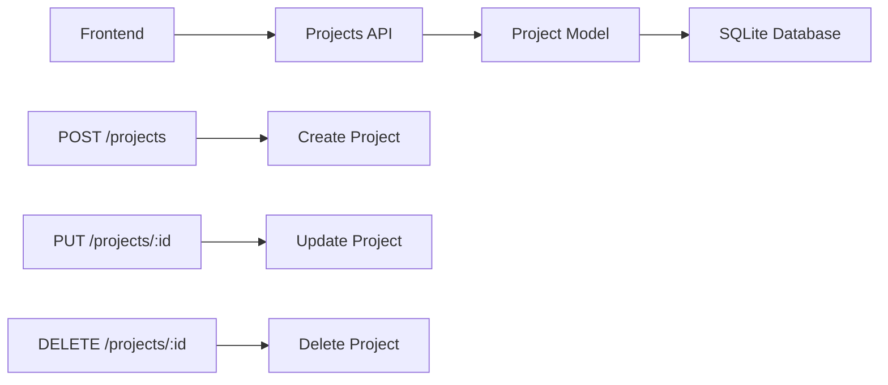
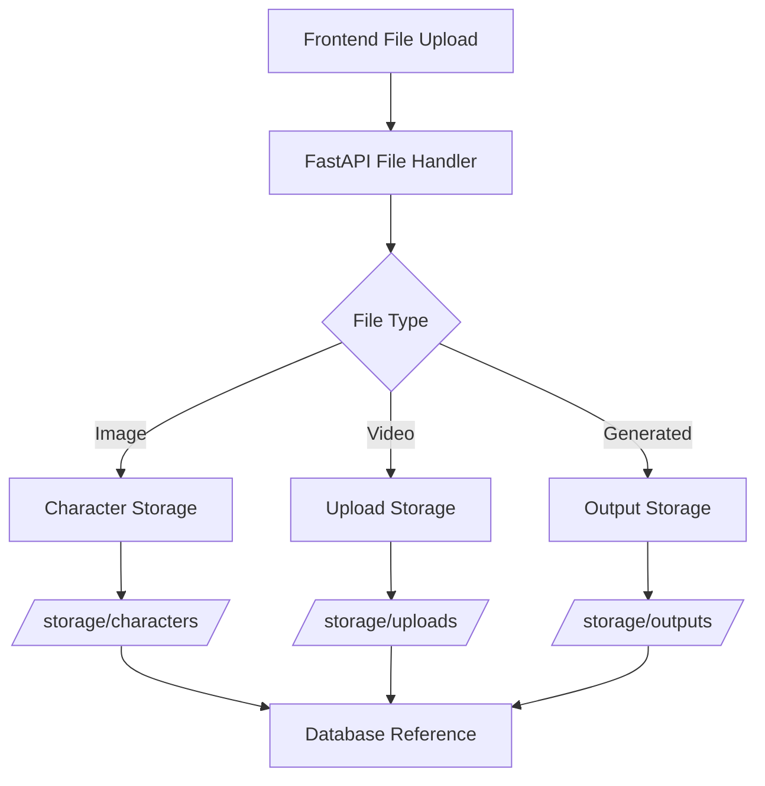
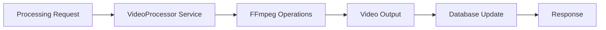
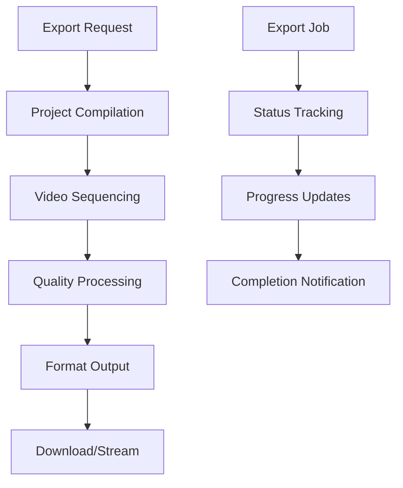
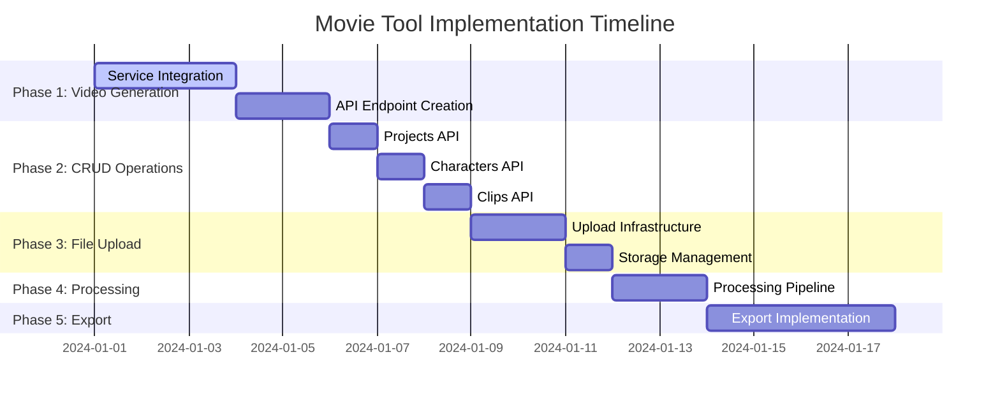

# Movie Tool API Implementation Plan
## Comprehensive Codebase Analysis & Phased Implementation Strategy

### Executive Summary

**Key Discovery**: The Movie Tool codebase has a **robust and fully implemented service layer**, but suffers from a critical disconnect between working services and API endpoints. Most CREATE/UPDATE operations return placeholder responses despite having functional backend services ready for integration.

### Current System Status

#### ✅ **FULLY IMPLEMENTED (Working Code)**
- **MiniMax API Service** - Complete video generation (T2V, I2V, S2V, camera controls)
- **Segmind API Service** - Complete video/image generation with Kling-2 integration  
- **VideoProcessor Service** - Comprehensive FFmpeg operations (extraction, merging, quality analysis)
- **Database Models & Schema** - Complete SQLAlchemy models with relationships
- **Read Operations** - All GET endpoints functional with proper database integration

#### ❌ **PLACEHOLDER CODE (Critical Issues)**
- **CREATE/UPDATE API Endpoints** - Return mock responses instead of using working services
- **Processing API Endpoints** - All placeholders despite having working VideoProcessor service
- **File Upload Handling** - Missing despite services supporting it
- **Integration Layer** - No connection between working services and API endpoints

---

## Phase-by-Phase Implementation Plan

### **Phase 1: Video Generation Integration** 🎥
**Priority: HIGHEST | Complexity: MEDIUM | Effort: 3-5 days**

**Objective**: Connect fully-implemented video generation services to working API endpoints

#### 1.1 Core Video Generation API Implementation
```mermaid
graph TD
    A[Frontend VideoGenerator] --> B[/api/v1/clips/generate]
    B --> C{Generation Type}
    C -->|Text-to-Video| D[MiniMax T2V Service]
    C -->|Image-to-Video| E[MiniMax I2V Service]
    C -->|Character-to-Video| F[MiniMax S2V Service]
    C -->|Kling-2| G[Segmind API Service]
    D --> H[Video Processing Pipeline]
    E --> H
    F --> H
    G --> H
    H --> I[Database Storage]
    H --> J[File System Storage]
    I --> K[Return Clip Data]
    J --> K
```

**Files to Modify:**
- `backend/app/api/v1/clips.py` - Replace placeholders with service integration
- `backend/app/api/v1/processing.py` - Implement video generation endpoints
- Add request/response models for video generation

**Key Deliverables:**
- ✅ POST `/api/v1/clips/generate` - Text-to-video generation
- ✅ POST `/api/v1/clips/generate-from-image` - Image-to-video generation  
- ✅ POST `/api/v1/clips/generate-with-character` - Character-consistent video generation
- ✅ GET `/api/v1/clips/{clip_id}/status` - Generation status monitoring
- ✅ POST `/api/v1/clips/{clip_id}/download` - Download generated videos

#### 1.2 Configuration & Environment Setup
- Environment variable validation for API keys
- Service health check endpoints
- Error handling and retry logic
- API rate limiting and quota management

#### 1.3 Integration Testing
- Unit tests for service integrations
- End-to-end video generation workflows
- Error scenario handling

---

### **Phase 2: Core CRUD Operations** 📝
**Priority: HIGH | Complexity: LOW | Effort: 2-3 days**

**Objective**: Replace placeholder CRUD endpoints with functional database operations

#### 2.1 Projects API Implementation


**Files to Modify:**
- `backend/app/api/v1/projects.py` - Replace placeholder CREATE/UPDATE/DELETE
- Add Pydantic request/response models
- Implement proper validation and error handling

#### 2.2 Characters API Implementation  
**Files to Modify:**
- `backend/app/api/v1/characters.py` - Replace placeholder CREATE/UPDATE
- Add character image upload functionality
- Integrate with storage directory structure

#### 2.3 Video Clips API Implementation
**Files to Modify:**
- `backend/app/api/v1/clips.py` - Replace placeholder CREATE/UPDATE/DELETE
- Add clip metadata management
- Implement clip-to-project relationships

---

### **Phase 3: File Upload & Storage** 📁
**Priority: HIGH | Complexity: MEDIUM | Effort: 2-3 days**

**Objective**: Implement missing file upload capabilities

#### 3.1 File Upload Infrastructure


**Key Deliverables:**
- ✅ POST `/api/v1/characters/{id}/upload-image` - Character image upload
- ✅ POST `/api/v1/projects/{id}/upload-asset` - Project asset upload
- ✅ File validation and processing
- ✅ Storage management and cleanup
- ✅ Thumbnail generation for uploaded videos

#### 3.2 Storage Management
- File size validation and limits
- Supported format validation
- Storage quota management
- Automatic cleanup of orphaned files

---

### **Phase 4: Video Processing Pipeline** ⚙️
**Priority: MEDIUM | Complexity: LOW | Effort: 1-2 days**

**Objective**: Connect VideoProcessor service to API endpoints

#### 4.1 Processing API Implementation


**Files to Modify:**
- `backend/app/api/v1/processing.py` - Replace ALL placeholders
- Implement video merging, trimming, format conversion
- Add processing status monitoring

**Key Deliverables:**
- ✅ POST `/api/v1/processing/merge` - Merge multiple video clips
- ✅ POST `/api/v1/processing/trim` - Trim video clips
- ✅ POST `/api/v1/processing/convert` - Format conversion
- ✅ GET `/api/v1/processing/{job_id}/status` - Processing status

---

### **Phase 5: Export & Advanced Features** 🚀
**Priority: MEDIUM | Complexity: HIGH | Effort: 3-4 days**

**Objective**: Complete export functionality and advanced features

#### 5.1 Export Pipeline Implementation


#### 5.2 Advanced Features
- Batch processing capabilities
- Quality analysis and optimization
- Multiple export formats
- Background job processing with status updates

---

## Implementation Dependencies & Sequencing

### Critical Path Analysis


### Technology Stack Validation
- ✅ **FastAPI** - Production-ready async framework
- ✅ **SQLAlchemy + SQLite** - Robust ORM with working models
- ✅ **Pydantic** - Request/response validation
- ✅ **aiohttp** - Async HTTP client for external APIs
- ✅ **FFmpeg** - Video processing (already integrated)

---

## Risk Assessment & Mitigation

### **HIGH RISK** 🔴
1. **External API Dependencies**
   - **Risk**: MiniMax/Segmind API key limitations or rate limits
   - **Mitigation**: Implement fallback mechanisms, proper error handling, mock services for development

2. **Video Processing Performance**
   - **Risk**: Large video files causing timeouts
   - **Mitigation**: Async processing, progress tracking, file size limits

### **MEDIUM RISK** 🟡
1. **Storage Management**
   - **Risk**: Disk space limitations
   - **Mitigation**: Implement cleanup routines, storage monitoring

2. **Database Schema Changes**
   - **Risk**: Breaking existing data
   - **Mitigation**: Database migration scripts, backup procedures

### **LOW RISK** 🟢
1. **CRUD Implementation**
   - **Risk**: Minimal - straightforward database operations
   - **Mitigation**: Comprehensive testing

---

## Quality Assurance Strategy

### Testing Approach
1. **Unit Tests** - Service layer validation
2. **Integration Tests** - API endpoint functionality  
3. **End-to-End Tests** - Complete user workflows
4. **Performance Tests** - Video generation load testing

### Success Criteria
- ✅ All placeholder endpoints replaced with functional implementations
- ✅ Video generation working end-to-end
- ✅ File upload and storage operational
- ✅ Export functionality complete
- ✅ 95%+ test coverage for new implementations

---

## Effort Estimation Summary

| **Phase** | **Effort** | **Complexity** | **Dependencies** |
|-----------|------------|----------------|------------------|
| **Phase 1: Video Generation** | 3-5 days | Medium | External API keys |
| **Phase 2: CRUD Operations** | 2-3 days | Low | Database access |
| **Phase 3: File Upload** | 2-3 days | Medium | Storage configuration |
| **Phase 4: Processing** | 1-2 days | Low | FFmpeg installation |
| **Phase 5: Export** | 3-4 days | High | All previous phases |
| **TOTAL** | **11-17 days** | | |

---

## Next Steps

1. **Immediate Action**: Begin Phase 1 - Video Generation Integration
2. **Environment Setup**: Validate API keys and service configurations
3. **Development Setup**: Ensure all dependencies are installed
4. **Testing Infrastructure**: Set up automated testing pipeline

---

*This plan leverages the significant work already completed in the service layer, focusing on connecting existing robust implementations to working API endpoints rather than building from scratch.*